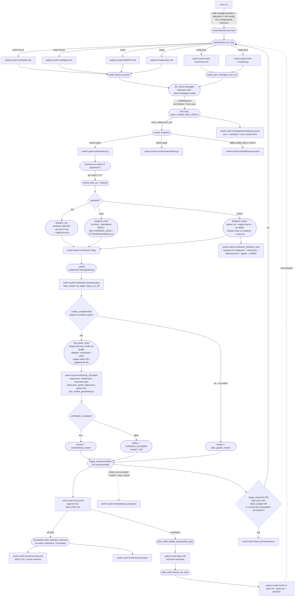

# Data-Flow Diagram — one attempt end-to-end

Covers the 7-stage feedback loop implemented by `legacy/harness2/orchestrator.run_loop`
(the planner-authors-variant path). The current primary loop is `runner/agentloop/loop.py`;
see README.md and FLOW.md for it.
Files/artifacts are shown as rectangles; processes as rounded boxes; branches as diamonds.

---

## Stage-by-stage — what goes in, what comes out

| Stage | Process | Files IN | Files OUT |
|-------|---------|----------|-----------|
| **0. entry** | `runner.harness.main` -> `orchestrator.run_loop` | CLI args, `.llm_config/claude-code.json` | (in-memory state) |
| **1a. planner input build** | `build_system_prompt` + `build_user_message_from_run` | `AGENTS.md`, `instruction.md`, `runN/plan.md`, `runN/goal.md` (frozen), prior `runN-1/summary.md`, prior `runN-1/variant.py` | in-memory system+user prompts |
| **1b. planner LLM call** | `llm_client.messages` via the Anthropic SDK, pointed at `<base_url>` | system + user prompts | `LLMResponse(text_blocks, tool_uses, stop_reason, raw)` + `planner/trajectory.jsonl` (user + assistant + tool_results turns) |
| **1c. variant persist** | tool_use dispatch (write_variant / spawn_subagent / update_plan_section / append_thread / add_ruled_down) | `LLMResponse.tool_uses` | `runN/variant.py`, `policy/runN/variants/iterN.py`, `runN/diff/variant.patch` (unified diff vs runN-1) |
| **1d. dispatch per seed** | `mount_task` + `dispatch_{dry\|local\|harbor}` | `runN/variant.py`, task tree | per-seed: `seed_S/log`, `seed_S/trajectory.json` (dry only), `seed_S/harbor_trial/{config.json, result.json, trajectory.json, agent/, verifier/}` (harbor only) |
| **2. task grader** | `_grade` subprocess `tests/grader.py` | `seed_S/log` | `seed_S/reward.json` (task_reward, hit_target, step_to_3_28) |
| **3. BIA verifier** | `bia_grade_seed` subprocess `bia_verifier.cli grade` | `seed_S/`, `tasks/<t>/verifier/dataset.json + predicates.py + rubric.json`, judgements file OR live Codex judge | `seed_S/verifier/{report.json, reward.json, outcomes.json, rubric.json, pytest_report.json, pytest.xml, test_verifier_generated.py}` |
| **3b. ledger row** | `ingest_result.normalize` + `append` | reward payload merged with BIA result | `runs/<uuid>/runs.jsonl` (append-only, 33-field row, fcntl locked) |
| **4. summarize** | `summarize.write_attempt_summary` | full ledger | `runN/summary.md` (SPEC §11.2 seven sections), `runN/summary.json` |
| **5. write plan + freeze** | `plan_writer.update_plan/update_goal` + `freeze_run_plan` | ledger, top-level `plan.md`+`goal.md` | top-level `plan.md` refreshed, `policy/<uuid>/runN+1/{plan.md, goal.md, variants/}` frozen |
| **6. attempt meta** | side-write from run_loop | in-memory accumulators | `runN/attempt_meta.json` (attempt, tokens, model, stop_reason, turns) |
| **7. stop conditions** | run_loop tail | ledger, wall-clock, cumulative_input_tokens, consecutive_incomplete counter | `loop_terminated.json` (if any condition tripped) OR continue |

---

## Legend

- `<uuid>` = `_slugify(task.toml [task].name)` — e.g., `nanogpt-track3-speedrun`
- `<t>` = task dir name (e.g., `nanogpt-speedrun`)
- `runN` = zero-padded attempt number (`run01`, `run02`, …) derived from loop counter (SPEC R10/D14)
- Solid arrows = required data flow
- Dotted arrows = side-writes or loop-back
- Rectangles = files on disk
- Rounded rectangles = processes/functions
- Diamonds = branches

## Skeptical caveats (things this diagram hides)

1. **Failure branches**: every arrow assumes success. LLM 429 is uncaught in `run_loop` and aborts mid-attempt, leaving partial disk state.
2. **Config sharing**: `.llm_config/claude-code.json` is read by BOTH the planner (Stage 1b) AND Harbor CLI (Stage 1d). Same Anthropic quota.
3. **`--no-verifier`**: bypasses Stage 3 entirely; `consolidated_reward`, `verification_complete`, `process_score` all null in ledger.
4. **Frozen plan divergence**: `policy/<uuid>/runN/plan.md` is a copy at freeze time; top-level `plan.md` keeps mutating via `update_plan_section` tool_use calls after.
5. **Retry**: `--retry K` covers Stage 1d only. BIA in Stage 3 has no retry.
6. **No prompt caching**: full ~17KB system prompt sent fresh on every planner call. `anthropic-beta: prompt-caching-2024-07-31` is NOT wired.
7. **Planner trajectory not consumed**: `planner/trajectory.jsonl` is written but no downstream code reads it. Only `summary.md` + `variant.py` propagate to next attempt.
